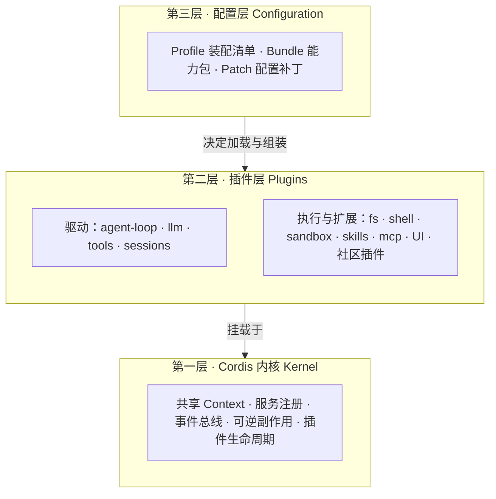

# 02 基础概念与核心架构

## DeepSeek Harness 是什么

### 一句话定位

**DeepSeek Harness（命令行名** `dsh`**）** 是 DeepSeek 推出的开源 AI Agent 框架。它的核心使命可以用一个公式概括：

> **Agent = Model + Harness**

大模型（Model）负责思考和推理；Harness 则是一套基础设施，让模型能够真正执行任务、调用工具，成为能在现实中工作的「智能体」（Agent）。

官方仓库：[https://github.com/deepseek-ai/deepseek-harness](https://github.com/deepseek-ai/deepseek-harness)

> 当前状态：Developer Preview，官方明确警告会有兼容性破坏性变更。具体 API 以仓库最新文档为准。

### Harness vs Framework

行业共识进一步拆解：

> **Harness = Tools + Context + Loop**


| 类型                | 特点                      | 代表               |
| ----------------- | ----------------------- | ---------------- |
| **Framework（框架）** | 给你抽象构件，loop 是你自己的代码     | LangGraph、CrewAI |
| **Harness（脚手架）**  | 已配置好的执行与控制层，loop 由产品方提供 | Claude Code、dsh  |


DeepSeek 官方在文档中明确：**DeepSeek Harness itself is an agent harness, not an SDK project.**

### 它不是什么

DeepSeek Harness 并非一个简单的 AI 编程助手。它更像一个 **面向未来的、可自由定制的 AI Agent 操作系统**——将定义 Agent 能力的权力交还给了开发者和社区。

---


## 核心理念：一切皆插件

Harness 最与众不同的一点是 **「一切皆插件」（Everything is a Plugin）** 的设计理念。

你可以把 Harness 想象成 **「Agent 界的乐高」**：

- 传统的 Agent 产品（如 Claude Code）像功能固定的「精装房」
- Harness 则提供一套完整的「基建」——模型、工具、技能、会话管理、沙箱环境、乃至用户界面，**全部**是可以自由拆卸、替换和组合的插件

这套系统基于 **Cordis** 插件内核构建。Cordis 只负责管理插件的生命周期，让整个系统可以灵活重组而不崩溃。

### 架构分层




---


## 关键特性与能力


### 1. 工作区与会话管理

- **Workspace（工作区）**：为每个任务指定一个本地文件夹，Agent 的操作被限制在此范围内，更安全可控
- **Trajectory（轨迹）视图**：像回放录像一样，分步骤查看 Agent 的思考过程、工具调用细节和 Token 消耗，极大提升系统透明度


### 2. 强大的可扩展性与生态

由于「一切皆插件」的设计，Harness 的生态爆发力极强。据社区报道，发布后迅速获得大量 GitHub 关注，并吸引了众多作者贡献社区插件。例如：

- **ModLens** 等插件：让纯文本模型具备图像理解能力
- 多款开箱即用的桌面应用：降低非开发者使用门槛
- 插件生态基于 **npm** + GitHub topic `dsh-plugin` 分发


### 3. 模型中立性

虽然出自 DeepSeek，但 Harness **并非绑定自家模型**。它支持接入 OpenAI、Anthropic、Google、Qwen等近 40 家模型提供商，也可通过 OpenAI 兼容端点接入自定义模型。

---


## 四种预设模式（Preset）

四种预设模式本质上是为不同任务场景准备的「工具包」和「工作方式」。它们共享同一个底层引擎，但加载了不同的插件和能力配置。在 Web UI 的对话界面顶部，可以随时切换。

### 标准模式（Standard **Mode**）：功能全面的「多面手」


| 维度     | 说明                                               |
| ------ | ------------------------------------------------ |
| **定位** | 默认推荐模式，像装备齐全的软件工程师                               |
| **能力** | 文件编辑、Shell 命令、网页检索、任务规划；集成 Skills、子 Agent、工作流等   |
| **代价** | 加载大量工具定义到上下文，Token 消耗较高（例如简单打招呼也可能消耗 1 万+ Token） |
| **适用** | 日常编程、代码分析、项目搭建、自动化办公等需要综合能力的任务                   |


### PTC 模式（**Programs-That-Compose**）：高效批处理的「指挥官」


| 维度       | 说明                                                                           |
| -------- | ---------------------------------------------------------------------------- |
| **定位**   | 在标准模式基础上，增加「代码执行」能力                                                          |
| **工作方式** | 模型不再一步步调用工具，而是生成一段 TypeScript 代码，将多个工具操作串联起来，**一次性提交执行**——相当于「写个脚本把这事儿批量办了」  |
| **优势**   | 将多次「模型思考 → 工具执行 → 再思考」的往返压缩为一次操作，显著降低延迟和 Token 消耗。灵感来源于Cloudflare 提出的 PTC 概念 |
| **适用**   | 批量重命名文件、从海量日志中提取错误信息等涉及多步连续工具调用的任务                                           |


### 极简模式（Minimal **Mode**）：专注评测的「轻骑兵」


| 维度     | 说明                                                               |
| ------ | ---------------------------------------------------------------- |
| **定位** | 最极简、最纯粹的模式，专为基准测试和最小化环境设计                                        |
| **能力** | 只保留两个核心工具：持久 Shell 终端（bash）和文件编辑器（str_replace_editor）；系统提示词精简到极致 |
| **代价** | 上下文占用极低（简单打招呼约 1000+ Token，约为标准模式的十分之一），但牺牲了规划、联网、子 Agent 等高级能力  |
| **适用** | 官方跑模型 Benchmark 以确保结果可比性；也适合非常明确的单文件修改或简单命令                      |


### 创造模式（**Creative Mode**）：定制 Agent 的「工作台」


| 维度     | 说明                                                              |
| ------ | --------------------------------------------------------------- |
| **定位** | 为插件开发者和高级用户提供的「沙盒 / 实验室」                                        |
| **能力** | 拥有标准模式的全部能力，并额外开放运行时检查和插件实验权限；可在内存中试验新的插件组合，甚至指导模型创建新的 Agent 预设 |
| **风险** | 权限极高，能直接操作 Harness 自身运行状态，**不应在包含敏感数据或生产项目的环境中随意使用**            |


### 模式选择速查


| 模式    | 功能全面性 | 效率    | 环境纯净度 | 典型场景             |
| ----- | ----- | ----- | ----- | ---------------- |
| 标准模式  | ★★★★★ | ★★★   | ★★★   | 日常开发             |
| PTC模式 | ★★★★  | ★★★★★ | ★★★   | 多步批量工具调用         |
| 极简模式  | ★★    | ★★★★★ | ★★★★★ | Benchmark / 简单任务 |
| 创造模式  | ★★★★★ | ★★★   | ★★    | 插件开发与试验          |


---


## 配置分层：Profile / Bundle / Patch

配置分层机制是让「一切皆插件」理念落地的核心设计。三层结构协作，实现极高的灵活性和可定制性。

### 精炼总结


| 概念                | 回答的问题 | 一句话                                                |
| ----------------- | ----- | -------------------------------------------------- |
| **Profile（装配清单）** | 组装什么  | 一张蓝图，声明加载哪些 Bundle 以及如何应用 Patch，决定 Harness 以何种形态运行 |
| **Bundle（能力包）**   | 用什么组装 | 可复用的功能模块，提供实际代码、插件和基础配置                            |
| **Patch（配置补丁）**   | 如何微调  | 精确修改指令，在不改源码的前提下覆盖或插入配置项                           |


**比喻串联**：Profile 是「拼装说明书」，Bundle 是说明书里的「积木套件」，Patch 是对个别积木的「改装说明」。

### Profile：定义「要组装成什么」

Profile 是位于 `$DSH_HOME/profiles/<name>/` 目录下的组织单元，本身不包含功能代码，只负责声明最终要启动的 Harness 是什么样子。

**内置示例**：


| Profile    | 说明                          |
| ---------- | --------------------------- |
| `web`      | 启动带图形界面的交互式 Harness         |
| `headless` | 无界面、执行完任务就退出的命令行版本，适合脚本和自动化 |


启动方式：

```bash
dsh --profile web
dsh --profile headless "fix the failing test"
```


### Bundle：提供「可复用的能力包」

Bundle 是实际提供功能代码和配置的可分发单元，像「乐高积木块」。Profile 通过按顺序叠加不同的 Bundle 来组装完整功能。

**内置关键 Bundle**：


| Bundle         | 提供什么                                        |
| -------------- | ------------------------------------------- |
| `dsh-base`     | 所有 Profile 的基石：模型适配器、工具集、会话管理、持久化、沙箱等核心通用能力 |
| `dsh-web-app`  | Web 模式构建块：Web 服务器、API 网关、浏览器前端界面            |
| `dsh-headless` | 无头模式构建块：基于 dsh-base，加入一次性运行器等无界面组件          |


### Patch：实现「精确的配置微调」

Patch 通过 `cordis.patch.yml` 文件，可以 **覆盖** 已有配置行的 `config` 字段，或 **插入** 全新的配置行。每个操作精确到由 `id` 标识的配置行。

**⚠️ 重要规则：整行替换，而非合并**

当你通过 Patch 覆盖某个配置行时，写入的 `config` 会 **整体替换** 该行原有的全部配置，而不是将新老字段合并。如果你只写了想改的一个字段，未提及的字段会丢失（恢复为默认值）。

**应用顺序（优先级从低到高）**：

```
Bundle 自带的 Patch
  ← Profile 自带的 Patch（$DSH_HOME/profiles/<name>/cordis.patch.yml）
  ← 用户全局 Patch（$DSH_HOME/cordis.patch.yml）
  ← 命令行 --patch 参数（最高优先级，适合一次性实验）
```

验证命令：

```bash
dsh --profile web --dump-config
```

打印最终生成的完整配置树，是验证 Patch 是否生效的最佳方式。

用户层 Patch **热重载**：改 `cordis.patch.yml` 不用重启进程。

### 实际例子：Web 界面 + 自己的 DeepSeek API Key

**目标**：让 Harness 在浏览器中运行，并使用自己的 `sk-xxxxx` 作为 API Key。

**第一步：Profile —— 选** `web`

```yaml
# web Profile 核心内容（概念示意）
bundles:
  - dsh-base
  - dsh-web-app
```

蓝图已定，但 API Key 可能还是占位符。

**第二步：Bundle —— 自动加载官方包**


| 能力包           | 提供什么                               |
| ------------- | ---------------------------------- |
| `dsh-base`    | 模型连接器、文件读写、Shell 命令、会话记忆等「大脑级」基础能力 |
| `dsh-web-app` | 本地 Web 服务器 + 聊天界面 + 调用后端 API 的网关   |


**第三步：Patch —— 只改 API Key**

在 `$DSH_HOME/cordis.patch.yml` 中写入（注意整行替换，需补全所有字段）：

```yaml
- id: model.defaults
  config:
    model: "deepseek-chat"                  # 保留原值
    baseURL: "https://api.deepseek.com"     # 保留原值
    apiKey: "sk-我的真实密钥"                # 只改这一个
```

**最终启动**：

```bash
dsh --profile web
```

Harness 处理流程：读取 Profile → 加载 Bundle → 按优先级应用 Patch → 启动 Web 服务。浏览器打开 `http://127.0.0.1:3080`，背后调用的就是你自己的 DeepSeek API 账户。

**三者在实例中的角色**：


| 概念      | 在这个例子中的角色                              |
| ------- | -------------------------------------- |
| Profile | 选了官方 `web` 清单，决定「我要 Web 界面形态」          |
| Bundle  | 自动加载 `dsh-base`（大脑）和 `dsh-web-app`（界面） |
| Patch   | 写一行补丁，把 API Key 从占位符改成真实密钥             |


> 更推荐的方式：在 Settings → Models 中填写 API Key（热生效，写入 `$DSH_HOME/.credentials.yaml`），无需手写 Patch。Patch 方式适合自动化部署或批量配置场景。


### Preset 与 Profile 的区别


| 概念          | 层级  | 作用                                                |
| ----------- | --- | ------------------------------------------------- |
| **Profile** | 进程级 | 决定 Harness 以 web / headless 等何种形态启动               |
| **Preset**  | 会话级 | 决定每个 Agent 会话加载哪些工具组合（标准模式 / PTC模式 / 极简模式 / 创造模式） |


同一进程里，不同会话可以跑不同的预设模式（Preset）组合。

---


## 事件驱动与可观测性


### 事件驱动：一切皆可被「听到」

Harness 采用事件驱动架构。「一切皆插件」的理念也延伸到了事件体系——它像一个广播电台，在运行的每一个关键节点都会「广播」事件，各种插件则像收音机，可以自由选择订阅和响应。

**核心：只追加的会话事件日志（Append-only SessionEvent Log）**

Harness 将一次 Agent 会话中的用户消息、Agent 回复、工具调用及其结果、轮次（Turn）、步骤（Step）等所有信息，都以「只追加」的方式按顺序记录，形成不可篡改的事实账本。

**铁律：Model-visible ⟺ Logged**

> 凡是对模型可见的信息，都必须能从日志中重建。

这使得会话可以被随时 **回放、分叉（Fork）、崩溃后恢复**，为系统的持久化和可靠性奠定基础。

**可监听的事件类型**（通过 `ctx.on()`）：


| 类别   | 示例                         |
| ---- | -------------------------- |
| 生命周期 | `session/start`、`turn/end` |
| 工具调用 | `tool/call`                |
| 系统   | `error`                    |


**进入模型历史（surface）的事件**只有三种：`user/message`、`assistant/message`、`tool/result`。

**配套机制**：

- **Compaction（压缩）**：追加遮蔽事件，旧事件仍在日志里，模型 history 读 surface 只看到摘要
- **Spill**：超大工具输出外置到文件，结果替换为预览 + 引用
- 存储后端：JSONL（默认 Zstd 压缩）或 SQLite


### 可观测性：从「知道发生了什么」到「看清为什么发生」


| 层次              | 回答的问题                                   |
| --------------- | --------------------------------------- |
| **Logs（日志）**    | 发生了什么？工具 A 调用了，模型 B 推理了                 |
| **Trace（链路追踪）** | 为什么花了 47 秒？时间卡在模型还是工具？重试了几次？Token 消耗多少？ |
| **Metrics（指标）** | 趋势如何？成本、延迟、成功率的变化                       |


Trace 将零散事件组织成带父子关系和时间区间的调用树，是分析和优化性能的关键。

### 两条主流集成路线

Harness 的可观测能力主要通过社区和第三方插件实现，基于 **OpenTelemetry GenAI** 语义规范：


| 特性   | 路线一：独立 OTLP 插件              | 路线二：LoongSuite Pilot 集成                |
| ---- | --------------------------- | -------------------------------------- |
| 运行形态 | Harness 进程内的独立 Cordis 插件    | Harness 注入插件 + 本地 daemon 进程            |
| 覆盖范围 | 仅观测 DeepSeek Harness 自身     | 可统一观测多种 AI Agent（Claude Code、Cursor 等） |
| 数据出口 | OTLP/HTTP 导出 Trace 和 Metric | 本地 JSONL、HTTP、SLS、OTLP Trace 等         |
| 适合场景 | 轻量接入，已有兼容 OTLP 的后端          | 混用多个 Agent，需要统一账本和团队视图                 |


### 社区生态案例


| 插件                    | 作用                                         |
| --------------------- | ------------------------------------------ |
| `dsh-observe`         | 官方包，对接 Langfuse 和 OTLP 后端，可控制捕获内容与脱敏规则     |
| `dsh-usage-analytics` | 社区插件，事件归一化存入 SQLite，提供 Token 用量趋势、成本概览等 UI |
| `dsh-event-auditor`   | 审计面板，实时观察 Harness 内部事件流，理解框架内幕的利器          |


> **安全提示**：事件化架构在提供强大可观测性的同时，也要求为管理 API 配置严格访问控制（如 IP 白名单、mTLS），避免未授权访问内部 RPC 方法。

